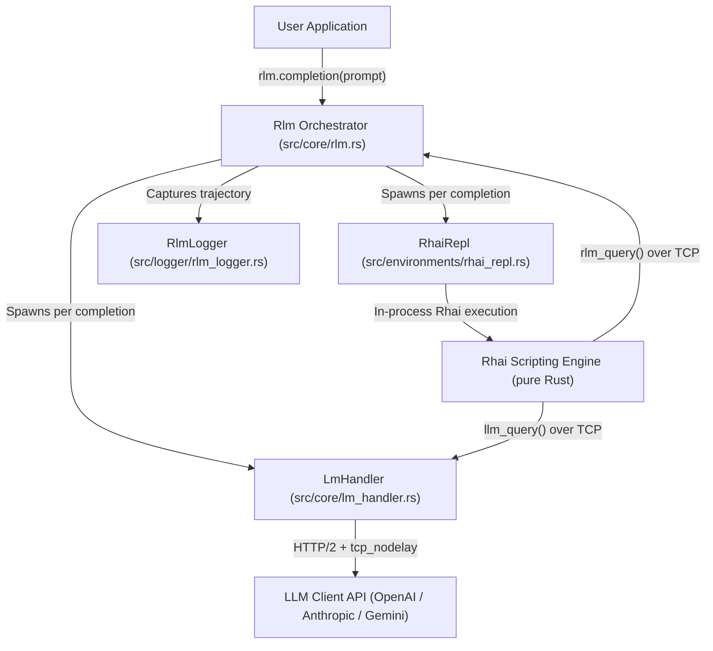

# RLM-Rust — Recursive Language Models in Rust 🦀

[](https://github.com/mohitjoer/RLM-Rust/actions/workflows/ci.yml)
[](https://crates.io/crates/rlm)
[](https://docs.rs/rlm)
[](LICENSE-MIT)

A high-performance, **fully Rust-based** inference engine for [Recursive Language Models (RLM)](https://arxiv.org/abs/2512.24601).

**No Python required.** Uses the embedded [Rhai](https://rhai.rs) scripting engine for sandboxed code execution.

RLMs provide a task-agnostic inference paradigm for language models to process near-infinite length contexts by enabling the LM to **programmatically examine, decompose, and recursively call itself** over its input within a sandboxed scripting REPL environment.

---

## 📌 Table of Contents
- [✨ Key Features](#-key-features)
- [🚀 Performance Optimizations](#-performance-optimizations)
- [💡 How RLM Reduces 100,000+ Tokens to ~3,000 Tokens](#-how-rlm-reduces-100000-tokens-to-3000-tokens)
- [⚡ Quickstart](#-quickstart)
- [📦 Supported LLM Providers](#-supported-llm-providers)
- [🏗️ Architecture Overview](#%EF%B8%8F-architecture-overview)
- [📚 Documentation](#-documentation)
- [🧪 Testing](#-testing)
- [👤 Author & Attribution](#-author--attribution)
- [📄 License & Attribution Terms](#-license--attribution-terms)

---

## ✨ Key Features

- 🚀 **Pure Rust** — No Python, no subprocess, no FFI. Uses the [Rhai](https://rhai.rs) embedded scripting engine (pure Rust, sandboxed).
- 📉 **97% Token & Cost Reduction** — Loads 100,000+ token context payloads directly into local REPL memory (`context`), sending only ~3,500 tokens to the API.
- ⚡ **Sub-Microsecond Code Execution** — Rhai scripts execute in-process with zero IPC overhead (vs. ~150ms Python subprocess startup).
- 🔌 **Multi-Provider Support** — Built-in REST clients for Google Gemini, OpenAI, Anthropic, OpenRouter, Vercel AI Gateway, vLLM, and Azure OpenAI.
- 🔄 **Recursive Sub-calls** — Native support for recursive child RLM spawning (`subcall`) and batched concurrent LLM queries (`llm_query_batched`).
- 🛡️ **Sandboxed Execution** — Rhai provides safe, sandboxed scripting with no filesystem or network access by default.

---

## 🚀 Performance Optimizations

This engine implements 5 latency optimizations over the original Python RLM:

| # | Optimization | Target Layer | Impact |
|---|---|---|---|
| 1 | **Pure Rust Rhai REPL** | Code Execution | ⚡ Zero subprocess IPC, sub-μs execution |
| 2 | **HTTP/2 + `tcp_nodelay`** | Network / HTTP | 📉 100-200ms saved per API call |
| 3 | **Connection Pooling** | HTTP Keep-Alive | 📉 Eliminates TLS handshake per turn |
| 4 | **Feature-Gated Architecture** | Compile-Time | 🏎️ Only compile what you need |
| 5 | **Zero-Copy JSON Parsing** | Serialization | 🚀 `serde` native, no string copies |

### Feature Flags

| Feature | Default | Description |
|---|---|---|
| `rhai-repl` | ✅ Yes | Pure-Rust Rhai scripting engine (recommended) |
| `python-repl` | ❌ No | Legacy Python subprocess REPL (requires `python3`) |

```toml
# Default: pure Rust (no Python needed)
rlm = "0.2"

# Legacy: use Python subprocess REPL
rlm = { version = "0.2", default-features = false, features = ["python-repl"] }
```

---

## 💡 How RLM Reduces 100,000+ Tokens to ~3,000 Tokens

Traditional LLM calls transmit the entire context payload over HTTP on every request. **RLM eliminates this bottleneck** by keeping large context payloads in local RAM:

### 1. Raw LLM Direct Call (Standard Way)
```text
You ──► Sends Prompt + 100,000-Token Context Payload over HTTP ──► Gemini API (Billed: 120,039 Tokens)
```

### 2. RLM Engine (Recursive Language Model Way)
```text
               ┌─────────────────────────────────────────────────────────────┐
               │              Your Local Machine (Pure Rust)                │
               │                                                             │
               │   1. Context (100,000 tokens) lives in local RAM:          │
               │      `context = "Data entry #00001 ..."`                    │
               └──────────────────────────────┬──────────────────────────────┘
                                              │
                                              │ (Sends ONLY instructions: ~1,500 tokens)
                                              ▼
                                     Gemini API Server
                                              │
                                              │ (Returns Rhai code: ~50 tokens)
                                              ▼
               ┌─────────────────────────────────────────────────────────────┐
               │  2. In-process Rhai REPL runs code in <1μs:                │
               │     `let matches = context.split("\n")                      │
               │       .filter(|l| l.contains("KEY"));`                      │
               │     `submit_answer(matches[0]);`                            │
               └─────────────────────────────────────────────────────────────┘
```

**Total Tokens Sent**: ~3,500 tokens (97.0% token & cost reduction).

---

## ⚡ Quickstart

Add `rlm` to your `Cargo.toml`:

```toml
[dependencies]
rlm = "0.2"
tokio = { version = "1", features = ["full"] }
serde_json = "1"
```

### Runnable Example

```rust
use rlm::core::rlm::{Rlm, RlmConfig};
use rlm::types::ClientBackend;

#[tokio::main]
async fn main() -> Result<(), Box<dyn std::error::Error>> {
    dotenvy::dotenv().ok();

    let config = RlmConfig {
        backend: ClientBackend::Gemini,
        backend_kwargs: serde_json::json!({
            "model_name": "gemini-2.5-flash",
            "api_key": std::env::var("GEMINI_API_KEY")?,
        }),
        max_iterations: 10,
        verbose: true,
        ..Default::default()
    };

    let mut rlm = Rlm::new(config, None);
    let result = rlm.completion("Find the secret in context", None).await?;

    println!("Answer: {}", result.response);
    println!("Tokens used: {}", result.usage_summary.total_input_tokens());

    Ok(())
}
```

### Running the Included Quickstart

```bash
export GEMINI_API_KEY="your_gemini_api_key"
cargo run --example quickstart
```

---

## 🏗️ Architecture Overview



---

## 📦 Supported LLM Providers

| Provider | Backend Identifier | Config Kwargs |
| :--- | :--- | :--- |
| **OpenAI** | `ClientBackend::OpenAi` | `model_name`, `api_key` |
| **Google Gemini** | `ClientBackend::Gemini` | `model_name`, `api_key` |
| **Anthropic** | `ClientBackend::Anthropic` | `model_name`, `api_key`, `max_tokens` |
| **OpenRouter** | `ClientBackend::OpenRouter` | `model_name`, `api_key`, `base_url` |
| **Vercel AI Gateway** | `ClientBackend::Vercel` | `model_name`, `api_key`, `base_url` |
| **vLLM (Local)** | `ClientBackend::Vllm` | `model_name`, `base_url` |
| **Azure OpenAI** | `ClientBackend::AzureOpenAi` | `model_name`, `api_key`, `base_url` |

---

## 📚 Documentation

The crate includes full Rustdoc API documentation. Build and view locally:

```bash
cargo doc --open
```

When published to [crates.io](https://crates.io), documentation will be available on [docs.rs](https://docs.rs).

---

## 🧪 Testing

Run the full test suite:

```bash
cargo test
```

Run unit tests or documentation tests individually:

```bash
cargo test --lib
cargo test --doc
```

Run formatting and linter checks:

```bash
cargo fmt -- --check
cargo clippy --all-targets -- -D warnings
```

---

## 👤 Author & Attribution

Created and maintained by **Mohit** ([@mohit](https://github.com/mohit)).

Based on the Recursive Language Model (RLM) inference paradigm ([Zhang et al., 2025](https://arxiv.org/abs/2512.24601)).

---

## 📄 License & Attribution Terms

This project is dual-licensed under the **MIT License** and the **Apache License 2.0**:

- Apache License, Version 2.0 ([LICENSE-APACHE](LICENSE-APACHE))
- MIT License ([LICENSE-MIT](LICENSE-MIT))

### ℹ️ Attribution Requirements
- **Free to Use**: Anyone is free to use, modify, distribute, or incorporate this software into commercial or open-source projects.
- **Mandatory Attribution**: You **must retain the original copyright notice (`Copyright (c) 2026 Mohit`) and attribution** in all copies, forks, or substantial portions of this codebase.
- **No False Authorship**: Re-branding, removing attribution, or claiming original creation of this engine is strictly prohibited under the license terms.
