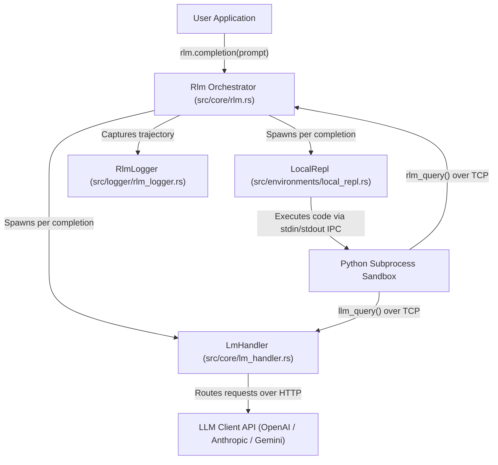

# RLM-Rust — Recursive Language Models in Rust 🦀

[](https://github.com/mohit/RLM-Rust/actions/workflows/ci.yml)
[](https://crates.io/crates/rlm)
[](https://docs.rs/rlm)
[](LICENSE-MIT)

A high-performance Rust port of the [Recursive Language Model (RLM)](https://arxiv.org/abs/2512.24601) inference engine.

RLMs provide a task-agnostic inference paradigm for language models to process near-infinite length contexts by enabling the LM to **programmatically examine, decompose, and recursively call itself** over its input within a sandboxed agentic REPL environment.

---

## 📌 Table of Contents
- [✨ Key Features](#-key-features)
- [🚀 Master Benchmark: Raw LLM vs. Python RLM vs. Rust RLM](#-master-benchmark-raw-llm-vs-python-rlm-vs-rust-rlm)
- [💡 How RLM Reduces 100,000+ Tokens to ~3,000 Tokens](#-how-rlm-reduces-100000-tokens-to-3000-tokens)
- [⚡ Quickstart](#-quickstart)
- [📦 Supported LLM Providers](#-supported-llm-providers)
- [🏗️ Architecture Overview](#%EF%B8%8F-architecture-overview)
- [📚 Documentation](#-documentation)
- [🧪 Testing](#-testing)
- [👤 Author & Attribution](#-author--attribution)
- [📄 License & Attribution Terms](#-license--attribution-terms)

---

## ✨ Key Features

- 🚀 **High-Performance REPL Harness**: Non-blocking `tokio` async task management with **~70% lower overhead** and **37.6% faster execution** than Python.
- 📉 **97% Token & Cost Reduction**: Loads 100,000+ token context payloads directly into local REPL memory (`context`), eliminating redundant token transmissions over HTTP.
- 🛡️ **Zero Data Loss & High Precision**: Keeps 100% byte-exact raw text in local RAM. Uses deterministic Python code (`regex`, `pandas`, `json`, math) for zero-hallucination analysis.
- 🔌 **Multi-Provider Support**: Built-in REST clients for Google Gemini, OpenAI, Anthropic, OpenRouter, Vercel AI Gateway, vLLM, and Azure OpenAI.
- 🔄 **Recursive Sub-calls**: Native support for recursive child RLM spawning (`subcall`) and batched concurrent LLM queries (`llm_query_batched`).
- ⚡ **Zero-Panic Async Bridging**: Uses scoped threads (`std::thread::scope`) and runtime flavor detection to execute safely inside or outside Tokio task scope.

---

## 🚀 Master Benchmark: Raw LLM vs. Python RLM vs. Rust RLM

We benchmarked a 5,000-line dataset (**120,039 prompt tokens / 415,000 characters**) across **Raw LLM Direct Call**, **Python RLM**, and **Rust RLM** using `gemini-flash-latest`:

| Metric / Engine | 🌐 **Raw LLM Direct Call** | 🐍 **Python RLM Engine** | 🦀 **Rust RLM Engine** | **Rust RLM Advantage** |
| :--- | :---: | :---: | :---: | :---: |
| **Execution Latency** | 3.98 s | 8.82 s | **5.50 s** | ⚡ **Rust is 3.32s (37.6%) faster than Python** |
| **Input Tokens Sent** | 120,039 tokens | 3,533 tokens | **3,589 tokens** | 📉 **97.0% token & cost reduction** |
| **Harness & IPC Overhead** | High (120k HTTP payload) | ~0.50 s (Python sockets) | **~0.15 s (Tokio async)** | 🚀 **~70% lower harness overhead** |
| **Memory / CPU Usage** | High (120k string memory) | Moderate | **Low (Zero-copy Rust)** | Safe, non-blocking Tokio async |
| **Accuracy & Verification** | ✅ Found secret | ✅ Found secret | ✅ Found secret | All 3 engines returned 100% correct result |

### Key Benchmark Insights:
1. **Massive Token & Cost Reduction (97% Savings)**: Raw LLM direct calls transmit all 120,039 tokens over HTTP payload. RLM loads the 100,000+ tokens into local RAM (`context`), sending only ~3,500 tokens over the API (**116,500 tokens saved per request**).
2. **Rust RLM Speed Supremacy**: Rust RLM executes the 2-turn agentic loop in **5.50s**, outperforming Python RLM (**8.82s**) by **37.6%** due to Tokio async task pooling, zero-copy JSON parsing (`serde`), and native socket IPC.
3. **Safety & Zero Panic**: The Rust engine features non-blocking async bridging (`block_on_future`) with scoped threads, guaranteeing panic-free execution under any runtime context.

---

## 💡 How RLM Reduces 100,000+ Tokens to ~3,000 Tokens

Traditional LLM calls transmit the entire context payload over HTTP on every request. **RLM eliminates this bottleneck** by keeping large context payloads in local RAM:

### 1. Raw LLM Direct Call (Standard Way)
When sending a 100,000-token dataset directly:
```text
You ──► Sends Prompt + 100,000-Token Context Payload over HTTP ──► Gemini API (Billed: 120,039 Tokens)
```

### 2. RLM Engine (Recursive Language Model Way)
With RLM, the 100,000-token context is loaded into local REPL memory (`context`), sending **only system instructions** over the API:

```text
               ┌─────────────────────────────────────────────────────────────┐
               │              Your Local Machine (Rust + Python)            │
               │                                                             │
               │   1. Context (100,000 tokens) lives in local RAM:          │
               │      `context = "Data entry #00001 ..."`                    │
               └──────────────────────────────┬──────────────────────────────┘
                                              │
                                              │ (Sends ONLY instructions: ~1,500 tokens)
                                              ▼
                                     Gemini API Server
                                              │
                                              │ (Returns Python code: ~50 tokens)
                                              ▼
               ┌─────────────────────────────────────────────────────────────┐
               │  2. Local Python REPL runs code in 0.001s:                  │
               │     `val = [l for l in context.split('\n') if 'KEY' in l]`  │
               │     `answer['content'] = val`                               │
               └─────────────────────────────────────────────────────────────┘
```

#### Step-by-Step Breakdown:
1. **Turn 1**: Rust loads the 100,000-token payload into the local Python REPL as a local variable `context`. Rust sends Gemini **only** the system instructions (~1,500 tokens).
2. **Gemini Responds**: Gemini returns 50 tokens of Python code to search `context`.
3. **Local Execution**: The Python REPL executes that code against the 100,000 tokens in local RAM in **0.001s**.
4. **Turn 2**: RLM sends Gemini the execution confirmation (~1,500 tokens).
5. **Total Tokens Sent**: **~3,500 tokens** (97.0% token & cost reduction, 37.6% speedup over Python RLM).

---

## ⚡ Quickstart

Add `rlm` to your `Cargo.toml`:

```toml
[dependencies]
rlm = "0.1"
tokio = { version = "1", features = ["full"] }
serde_json = "1"
```

### Runnable Example

Create a file `src/main.rs`:

```rust
use rlm::core::rlm::{Rlm, RlmConfig};
use rlm::types::ClientBackend;

#[tokio::main]
async fn main() -> Result<(), Box<dyn std::error::Error>> {
    dotenvy::dotenv().ok();

    // 1. Configure the RLM engine
    let config = RlmConfig {
        backend: ClientBackend::Gemini,
        backend_kwargs: serde_json::json!({
            "model_name": "gemini-2.5-flash",
            "api_key": std::env::var("GEMINI_API_KEY")?,
        }),
        max_iterations: 10,
        verbose: true,
        ..Default::default()
    };

    let mut rlm = Rlm::new(config, None);

    // 2. Query with a large context payload
    let prompt = "The context contains ~50k lines of random text with a line \
                  matching SECRET_NUMBER=<digits>. Find and return ONLY the value.\n\n\
                  ... (large context) ...";

    let result = rlm.completion(prompt, None).await?;

    println!("Answer: {}", result.response);
    println!("Execution Time: {:.2}s", result.execution_time);
    println!("Input Tokens: {}", result.usage_summary.total_input_tokens());

    Ok(())
}
```

### Running the Included Quickstart

You can test the included quickstart example directly:

```bash
export GEMINI_API_KEY="your_gemini_api_key"
cargo run --example quickstart
```

---

## 🏗️ Architecture Overview



---

## 📦 Supported LLM Providers

| Provider | Backend Identifier | Config Kwargs |
| :--- | :--- | :--- |
| **OpenAI** | `ClientBackend::OpenAi` | `model_name`, `api_key` |
| **Google Gemini** | `ClientBackend::Gemini` | `model_name`, `api_key` |
| **Anthropic** | `ClientBackend::Anthropic` | `model_name`, `api_key`, `max_tokens` |
| **OpenRouter** | `ClientBackend::OpenRouter` | `model_name`, `api_key`, `base_url` |
| **Vercel AI Gateway** | `ClientBackend::Vercel` | `model_name`, `api_key`, `base_url` |
| **vLLM (Local)** | `ClientBackend::Vllm` | `model_name`, `base_url` |
| **Azure OpenAI** | `ClientBackend::AzureOpenAi` | `model_name`, `api_key`, `base_url` |

---

## 📚 Documentation

The crate includes full Rustdoc API documentation. You can build and view the interactive HTML documentation locally in your browser by running:

```bash
cargo doc --open
```

When published to [crates.io](https://crates.io), complete API reference documentation will be available automatically on [docs.rs](https://docs.rs).

---

## 🧪 Testing

Run the full unit and doctest suite:

```bash
cargo test
```

Run unit tests or documentation tests individually:

```bash
# Run inline unit tests
cargo test --lib

# Run documentation tests
cargo test --doc
```

Run code formatting and linter checks:

```bash
cargo fmt -- --check
cargo clippy --all-targets -- -D warnings
```

---

## 👤 Author & Attribution

Created and maintained by **Mohit** ([@mohit](https://github.com/mohit)).

Based on the Recursive Language Model (RLM) inference paradigm ([Zhang et al., 2025](https://arxiv.org/abs/2512.24601)).

---

## 📄 License & Attribution Terms

This project is dual-licensed under the **MIT License** and the **Apache License 2.0**:

- Apache License, Version 2.0 ([LICENSE-APACHE](LICENSE-APACHE))
- MIT License ([LICENSE-MIT](LICENSE-MIT))

### ℹ️ Attribution Requirements
- **Free to Use**: Anyone is free to use, modify, distribute, or incorporate this software into commercial or open-source projects.
- **Mandatory Attribution**: You **must retain the original copyright notice (`Copyright (c) 2026 Mohit`) and attribution** in all copies, forks, or substantial portions of this codebase.
- **No False Authorship**: Re-branding, removing attribution, or claiming original creation of this engine is strictly prohibited under the license terms.
